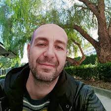
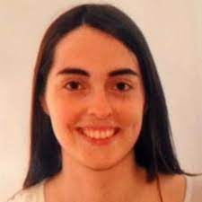
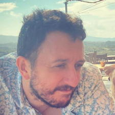

.. _home-page-about:

**************
About the course
**************

.. autosummary::
   :toctree: generated

This slow-paced hands-on course is designed for absolute beginners who want to start using scientific containers to achieve reproducibility of data analysis.

* `Course page <https://github.com/biocorecrg/ropes-linux-mop2-2023 >`_

.. |julia| image:: images/jponomarenko.jpg
  :alt: Julia Ponomarenko

.. list-table:: Main instructors:
   :widths: 50 50 50 50
   :header-rows: 1

   * - Luca Cozzuto
     - Anna Delgado
     - Toni Hermoso
     - Julia Ponomarenko
   * - |luca|
     - |adelgado|
     - |toni|
     - |julia|

.. _home-page-outline:

Outline
============

.. 
        Trainees will work in a dedicated `AWS environment <https://en.wikipedia.org/wiki/AWS/>`_.

.. _home-page-learning:

Learning objectives
============

* Learn the basics of command-line Linux
* Locate and fetch Docker/Singularity images from dedicated repositories.
* Execute/Run a Docker/Singularity container from the command line.
* Understand the components of Nextflow pipeline
* Run a Nextflow pipeline using your own data and tuning it with different parameters

