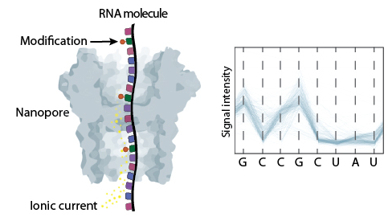
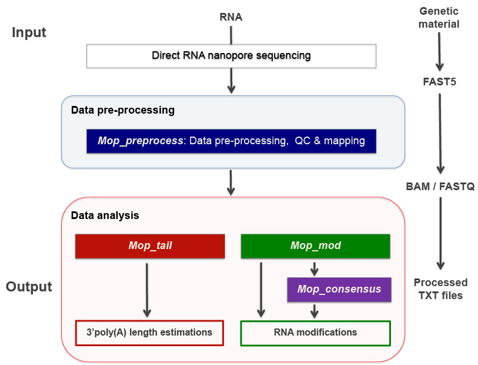
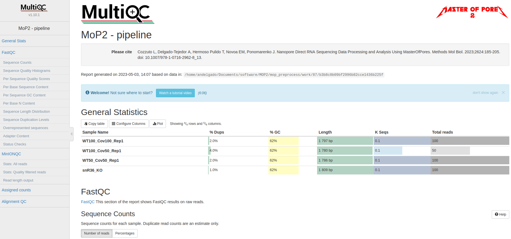
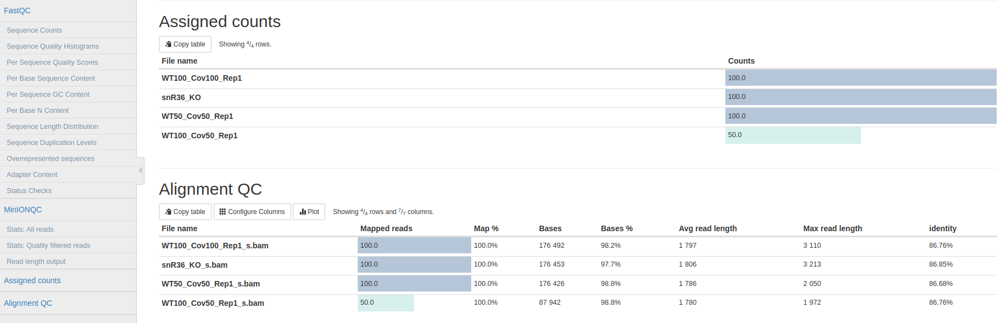
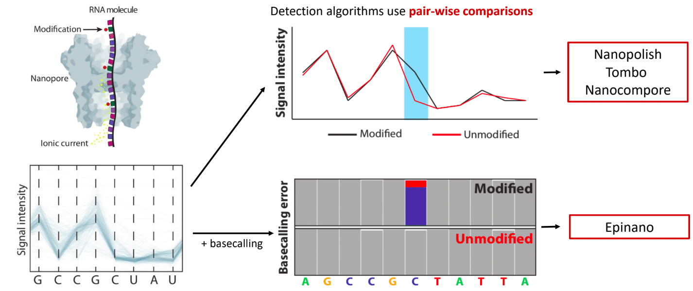
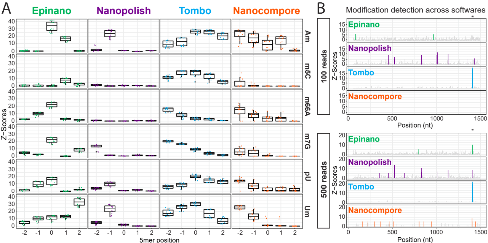
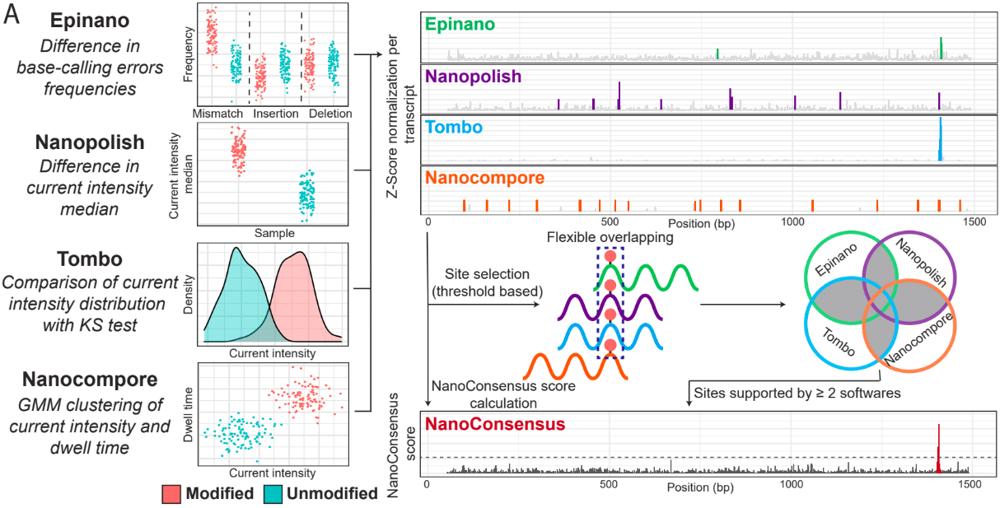

.. _mop2_practical-page:

*******************
Master of Pores 2
*******************

Basics of Direct RNA Sequencing (DRS)
---------------------
Direct RNA sequencing is a technology developed by Oxford Nanopore Technologies (ONT) that allows the sequencing of native RNA molecules without the need of previous amplification nor fragmentation. Therefore, it provides information about the presence of RNA modifications, polyA tail length and composition at per-read level. 

This method is based on the use of protein nanopores that are embedded into a membrane. As the molecule goes through the pore, it alters the ionic current that is applied to it. These changes are then stored in **fast5 files**.

Master Of Pores 2 (MOP2) - preprocessing and polyA tail estimation (1)
---------------------

The complexity of analysing current intensity data together with the lack of systematic and reproducible pipelines have hindered the access of this technology to the general users. To overcome this limitation, we developed Master Of Pores (**MoP**) - a nextflow based workflow that simplifies the analysis of DRS datasets and aims to make it accessible to non-bioinformatic experts. We further improved this suit making a new version (**MoP2**). 

For more information you can read our pubblications:

* `"MasterOfPores: A Workflow for the Analysis of Oxford Nanopore Direct RNA Sequencing Datasets" Cozzuto L, Liu H, Pryszcz LP, Hermoso Pulido T,  Delgado-Tejedor A, Ponomarenko J and Novoa EM. Front. Genet., 17 March 2020. <https://www.frontiersin.org/articles/10.3389/fgene.2020.00211/full>`__
* `"Nanopore Direct RNA Sequencing Data Processing and Analysis Using MasterOfPores" Cozzuto L, Delgado-Tejedor A, Hermoso Pulido T, Novoa EM, Ponomarenko J. N. Methods Mol Biol. 2023;2624:185-205. <https://link.springer.com/protocol/10.1007/978-1-0716-2962-8_13>`__

MOP2 can perform all steps required to analyse DRS data - from converting raw current intensities into multiple types of processed data to RNA modified sites detection and polyA tail length predictions. This pipeline consists of four modules: *mop_preprocess*, *mop_tail*, *mop_mod* and *mop_consensus*.

Basic preprocessing (module: *mop_preprocessing*)
......................

The pre-processing module is able to perform base-calling, mapping (either to a genome or a transcriptome), feature counting (per-gene level) and quality control. Furthermore, if required by the user, it can run demultiplexing, filtering and discovery of novel transcripts. As the final step, the workflow generates a final report of the performance and results of each of the steps performed. 

.. note::
  Before proceeding to any other downstream analysis such as RNA modification detection and polyA tail analysis, this module **must** be executed. 
  
**Analysis overview:**

- **Step 1a: Basecalling**

  It is the process by which the current intensity data is translated into a nucleotide sequence by a machine learning algorithm called basecaller. Currently, the most widely used is **Guppy**, which was developed by ONT and it is only available if you are part of the ONT community. The model that Guppy uses to analyse RNA data is not modification aware and therefore, it can only identify the four canonical bases (A, U, C and G).
  
  - **Input:** Raw fast5 files
  - **Output:** Basecalled fast5 and fastq files

.. tip::
  **How do we know if fast5 files are bassecalled or not?**

  Raw and basecall fast5 files have the same extension (.fast5) and in consequence, the only way of knowing if a fast5 file is basecalled or not is to check its contents. Please use the code below:
  
  .. code-block:: console

    #Install h5ls:
    apt-get install hdf5-tools
    
    #Investigate fast5 files' structure:
    h5ls /path/to/fast5 | head -n15
  
  
  .. |raw| image:: images/raw.png
    :alt: Missing raw fast5

  .. |basecalled| image:: images/basecalled.png
    :alt: Missing basecalled fast5
    
  .. list-table::
   :widths: 100 100
   :header-rows: 1

   * - Raw
     - Basecalled

   * - |raw|
     - |basecalled|

- **Step 1b: Demultiplexing**
  
  Demultiplexing is required when analysing a barcoded sample; otherwise, this step is not necessary. **Deeplexicon** is used when analysing dRNA. This algorithm converts the barcode's signal into an image, which is then classified based on a machine-learning approach. For cDNA, DNA and metDNA you can specify within the parameters to use **Guppy**.
  
  - **Input:** Raw fast5 files
  - **Output:** Demuxed raw fast5 files
   
- **Step 2: Filtering**
  
  Filter out reads based on either quality and/or length performed by **Nanofilt**. For RNA modification detection using DRS data, this step should be turned off as modified reads tend to have lower quality than unmodified ones and thus, filtering based on quality would bias the results.
  
  - **Input:** Fastq files
  - **Output:** Filtered fastq files

- **Step 3: Alignment**
  
  Mapping step performed by either **minimap2** or **grapmap**. Both can perform spliced or unspliced alignments. Briefly, we would use spliced alignments when using a genome as a reference and; unspliced for transcriptome. Furthermore, it has been reported that minimap2 fails to align highly modified reads and thus, it should not be used to analyse data from highly modified RNA species such as rRNAs. 
  
  - **Input:** Fastq files and reference file (genome or transcriptome)
  - **Output:** Bam (and bai) files
  
- **Step 4: Feature counts**
  
  The software run by MOP2 to perform this step depends on the type of reference used in the mapping step. For transcriptome alignments, **NanoCount** is used and it reports per transcript abundances whereas for genome alignments, **htseq-count** is executed and it generates per-gene counts. 
  
  - **Input:** Reference and alignment file (bam) for NanoCount // Reference, annotation (*.gtf) and alignment files (*.bam) for htseq-count
  - **Output:** Transcript abundances' estimations // Per-gene counts

- **Step 5: Transcript discovery**

  **Bambu** aims to identify novel transcripts from mapped reads. For more information about how to use this tool, please visit its `GitHub page <https://github.com/GoekeLab/bambu#General-Usage>`_.
  
  - **Input:** Alignment (.bam), reference (.fa) and annotation (.gtf)
  - **Output:** Transcript's abundances and read id-transcript assignments
  
- **Step 6: Reporting and quality control**

  **multiQC** produces the final report, as a html page, which contains the quality control's results generated by **MinionQC** together with the stats from the previous executed steps. 
  
  - **Input:** all inputs and outputs
  - **Output:** final report

We will show how to use and configurate this module in the next hands-on exercise. 

PolyA tail length analysis (module: *mop_tail*)
......................

This module estimates poly(A) tail length at read level provided by **Tailfindr** and/or **Nanopolish**. This workflow uses as input all the files generated by *mop_preprocess*. 

**Analysis overview:**

- **Software 1: Tailfindr**
  
  - **Input:** Basecalled fast5 files and read id-gene assignments
  - **Output:** PolyA tail length estimations

- **Software 2: Nanopolish**

  - **Input:** Fastq (.fq.gz), alignment (.bam) and reference (.fa) files
  - **Output:** PolyA tail length estimations

Hands-on 1: *mop_preprocess* and *mop_tail*
---------------------

MOP2 installation and data preprocessing:
......................

For installing the MoP2 pipeline and downloading guppy 3.4.2, please use the code below:

.. code-block:: console

  git clone --depth 1 --recurse-submodules https://github.com/biocorecrg/MOP2.git
  
  cd MoP2; bash INSTALL.sh 3.4.2

For this hands-on exercise, we will perform polyA tail length estimation and RNA modification detection on total RNA DRS samples from *Saccharomyces cerevisiae* (see list below):

- Sample 1: snR36 knock-out strain
- Samples 2, 3 and 4: wild-type strains

We need to downolad the test dataset that is bundled in this repository

.. code-block:: console

  wget https://biocorecrg.github.io/ropes-linux-mop2-2023/data/nanopore.tar.gz
 
  --2023-05-10 15:48:30--  https://biocorecrg.github.io/ropes-linux-mop2-2023/data/nanopore.tar.gz
  Resolving biocorecrg.github.io (biocorecrg.github.io)... 185.199.108.153, 185.199.111.153, 185.199.110.153, ...
  Connecting to biocorecrg.github.io (biocorecrg.github.io)|185.199.108.153|:443... connected.
  HTTP request sent, awaiting response... 200 OK
  Length: 31740190 (30M) [application/gzip]
  Saving to: ‘nanopore.tar.gz’

  100%[=======================================================================>] 31,740,190   123MB/s   in 0.2s   

  2023-05-10 15:48:35 (123 MB/s) - ‘nanopore.tar.gz’ saved [31740190/31740190]

  ls -alh nanopore.tar.gz 
  -rw-r--r-- 1 lcozzuto Bioinformatics_Unit 31M May 10 15:45 nanopore.tar.gz
  
  tar -zvxf nanopore.tar.gz 
  nanopore/
  nanopore/WT100_Cov50_Rep1/
  nanopore/WT100_Cov100_Rep1/
  nanopore/Saccharomyces_cerevisiae.rRNA.fa
  nanopore/snR36_KO/
  nanopore/WT50_Cov50_Rep1/
  nanopore/WT50_Cov50_Rep1/batch_unmodified0.fast5
  nanopore/WT50_Cov50_Rep1/batch_modified0.fast5
  nanopore/snR36_KO/batch0.fast5
  nanopore/WT100_Cov100_Rep1/batch_modified0.fast5
  nanopore/WT100_Cov50_Rep1/batch_modified0.fast5

Before setting up *mop_preproceess* module, it is important that you think about which softwares and parameters should be used - otherwise you might run analysis that are not suitable to your sample (and you will lose time and resources). Please, answers the questions below:

- **Question 1:** Which is the most abundant RNA specie in your samples? Is it highly or lowly modified?

- **Question 2:** Which reference would you use (genome or transcriptome)? 

- **Question 3:** Would you use spliced or unspliced alignment? Why?

- **Question 4:** Which counter would you use? Why?

Now, we can start setting up the *mop_preproceess* module. Please follow the code below:

.. code-block:: console

  #Enter the mop_preprocess directory:
  cd mop_preprocess
  
  #List all files and directories:
  ls -l 
  
  #Summary of files:
  ## bin directory: it contains all the binaries used by this module. If you wanna change guppy version, you should go here.
  ## *_opt.tsv files: it is used to input additional parameters to the individual softwares executed by the workflow.
  ## params.config file: it is the file that the user must edit to introduce the inputs required by the workflow.
  
  #Edit params.config file:
  nano params.config
  
  #Params.config content:
  params {
    conffile            = "final_summary_01.txt"
    fast5               = "/home/andelgado/Documents/cluster/users/andelgado/ROPES_training/data_mod_consensus/**/*.fast5"
    fastq               = ""

    reference           = "/home/andelgado/Documents/software/NanoConsensus/ref/Saccharomyces_cerevisiae.rRNA.fa"
    annotation          = ""
    ref_type            = "transcriptome"

    pars_tools          = "drna_tool_unsplice_opt.tsv" 
    output              = "$baseDir/output"
    qualityqc           = 5
    granularity         = 1

    basecalling         = "guppy"
    GPU                 = "OFF"
    demultiplexing      = "NO"
    demulti_fast5       = "NO" 

    filtering           = "NO"

    mapping             = "graphmap"
    counting            = "nanocount"
    discovery           = "NO"

    cram_conv           = "NO"
    subsampling_cram    = 50

    saveSpace           = "NO"

    email               = "username@domain"
  }
  
  #Save file and exit:
  CTRL+o
  CTRL+x

As discussed earlier, these options are okay when analysing total RNA samples. However, depending on the type of sample, changes in the params.config file should be made. Click `here <https://biocorecrg.github.io/MOP2/docs/mop_preprocess.html>`_ to check all parameters accepted by *mop_preprocess*.

.. code-block:: console

  #Run the module in the background, with singularity and in the local computer:
  nextflow run mop_preprocess.nf -with-singularity -bg -profile local > log_preprocess.txt
  
Results
......................

Once the module has finished, these directories should be in your output folder:

- **fast5_files**: Contains the basecalled fast5 files.

- **fastq_files**: Contains one or, in case of demultiplexing, more fastq files.

- **QC_files**: Contains each single QC produced by the pipeline.

- **alignment**: Contains the bam and bai file(s).

- **counts**: Contains read counts per gene / transcript.

- **assigned**: Contains assignment of each read to a given gene / transcript.

- **report**: Contains the final multiqc report.

Now, we would look at the alignments in IGV (genome browser) together with the stats reported in the multiQC html to decide if we have enough quality data to proceed with the polyA tail length estimation and RNA modification detection analysis. Due to time limitations, here you should decide if we can proceed or not only based on the multiQC report.

- **Question 5:** Do we have enough data in all samples to proceed to the downstream analysis? Why? 

PolyA tail length estimation
......................

After preprocessing the data, we can go directly to run the *mop_tail* module which will output polyA tail length estimation at per read level. Please run the code below:

.. code-block:: console

  #Go to the directory:
  cd ./../mop_tail/
  
  #Edit params.config file:
  nano params.config
  
  #Params.config content:
  params {
    
    input_path         = "$baseDir/../mop_preprocess/output/"
    reference           = "/home/andelgado/Documents/software/NanoConsensus/ref/Saccharomyces_cerevisiae.rRNA.fa"

    pars_tools         = "$baseDir/tools_opt.tsv"

    output             = "$baseDir/outputPoly"

    tailfindr          = "YES"
    nanopolish         = "YES"
 
    email              = "username@domain"
  }
  
  #Save file and exit:
  CTRL+o
  CTRL+x

  #Run the module in the background, with singularity and in the local computer:
  nextflow run mop_tail.nf -with-singularity -bg -profile local > log_tail.txt
  
Results
......................

Once the module has finished, these directories should be in your output folder:

- **nanopolish_flow**: Contains nanopolish's results.

- **tailfindr_flow**: Contains tailfindr's results.

- **polya_common**: Contains the text files that include the combined polyA tail length predictions at per read-level. 

Check the generated files and answer these questions below:

- **Question 6:** Should we have done this analysis? Why? 

Master Of Pores 2 (MOP2) - RNA modification detection (2)
---------------------
Currently, due to the lack of RNA modification-aware basecallers, the most common methods to identify RNA modifications from DRS datasets rely on finding differences between two differentially modified samples (ie: comparing a wild-type sample against a knock-out/IVT one). All publicly available algortihms can be clustered into two groups based on the feature that they use to generate their predictions: 

Detection of RNA modifications (module: *mop_mod*)
......................
Using the files obtained from the preprocessing analysis as input, the module *mop_mod* from MOP2 runs four publicly available algorithms (**EpiNano**, **Nanopolish**, **Tombo** and **Nanocompore**) to detect RNA modifications from DRS data. These softwares use several features from the data to generate their predictions (see below):

- **EpiNano**: difference in basecalling errors (mismatch, insertion and deletion frequency). The sum of all these errors can also be used.
- **Nanopolish**: difference in median current intensity per position - although it was not designed to identify RNA modifications.
- **Tombo**: difference in current intensity values' distribution (KS test).
- **Nanocompore**: difference in clusters based on current intensity and dwell time values.

When using these algorithms, it is important to be aware of their limitations (and when applicable, take them into account to interpret our results!):

- Requirement of a KO/KD/IVT sample
- Signal across the 5mer differs between softwares
- Performance depends on coverage, modification type and stoichiometry
- Presence of false positives in their predictions

**Analysis overview:**

- **Software 1: EpiNano**
  
  - **Input:** Alignment (.bam) and reference (.fa) files 
  - **Output:** Basecalling errors (mismatch, insertion, deletion frequencies), coverage and base quality per-position.

- **Software 2: Nanopolish**

  - **Input:** Fastq (.fq.gz), alignment (.bam), reference (.fa) and summary (_final_summary.stats) files
  - **Output:** Median current intensity values per position as well as how many *resquiggled* reads do cover that position.
  
  MISSING TIP ABOUT RESQUIGGLING
 
- **Software 3: Tombo**

  - **Input:** Fastq (.fq.gz), alignment (.bam), reference (.fa) and summary (_final_summary.stats) files
  - **Output:** -Log10(p-value) obtained from the KS-test when comparing current intensity values' distribution as well as how many *resquiggled* reads do cover that position (per position).

- **Software 4: Nanocompore**

  - **Input:** Fastq (.fq.gz), alignment (.bam), reference (.fa) and summary (_final_summary.stats) files
  - **Output:** P-values obtained when comparing clusters of reads from the two samples (per-position). 
  
We will show how to use and configurate this module in the next hands-on exercise.

Consensus detection of RNA modifications (module: *mop_consensus*)
......................

As we have previously seen, predictions generated by the four algorithms run by *mop_mod* show poor overlap due to different factors (see previous section). Based on this evidence, we reasoned that if the results from these algorithms would be combined in a consensual manner, the true differentially modified sites would be retained while the number of false positives would decrease. To this end, we developed **NanoConsensus**, which is run by the module *mop_consensus* inside MOP2. 

**Analysis overview:**

- **Input:** Predictions from EpiNano, Nanopolish, Tombo and NanoCompore (at least two of them).
- **Output:** Consensus prediction of differentially modified sites. 

For more information about **NanoConsensus** and the benchamrking results obtained when comparing its performance to other publicly available tools - please click `here <https://www.biorxiv.org/content/10.1101/2023.03.21.533606v1>`_. 

Hands-on 2: *mop_mod* and *mop_consensus*
---------------------

Detection of differentially modified sites
......................

After preprocessing the data, we can run the *mop_mop* module which runs four algorithms to identify differentially modified sites. Please run the code below:

.. code-block:: console

  #Go to the directory:
  cd ./../mop_mop/
  
  #Summary of files:
  ## comparison.tsv file: it is used to input the pairwise comparisons that the workflow should analyse. 
  ## params.config file: it is the file that the user must edit to introduce the inputs required by the workflow.
  
  #Edit params.config file:
  nano params.config
  
  #Params.config content:
  params {
    input_path         = "$baseDir/../mop_preprocess/output/"
    comparison         = "$baseDir/comparison.tsv"

    reference           = "/home/andelgado/Documents/software/NanoConsensus/ref/Saccharomyces_cerevisiae.rRNA.fa"
    
    output             = "$baseDir/output_mod"

    pars_tools         = "$baseDir/tools_opt.tsv"
    
    // flows 
    epinano       = "YES"
    nanocompore   = "YES"
    tombo_lsc     = "YES"
    tombo_msc     = "NO"

    // epinano plots
    epinano_plots = "YES"

    email              = "username@domain"
  }
  
  #Save file and exit:
  CTRL+o
  CTRL+x
  
  #Edit comparison.tsv file:
  nano comparison.tsv
  
  #Comparison.tsv content - IT MUST BE TAB SEPARATED!
  snR36_KO        WT100_Cov100_Rep1
  snR36_KO        WT100_Cov50_Rep1
  snR36_KO        WT50_Cov50_Rep1
  
  #Save file and exit:
  CTRL+o
  CTRL+x
  
  #Run the module in the background, with singularity and in the local computer:
  nextflow run mop_mod.nf -with-singularity -bg -profile local > log_mod.txt
  
Results
......................

Once the module has finished, these directories should be in your output folder: MISSING!!!

Detection of differentially modified sites with high confidence
......................

Once we have obtained the predictions from the four algorithms run by *mop_mod*, we can run **NanoConsensus** using the *mop_consensus* module. Please, run the code below:

.. code-block:: console

  #Go to the directory:
  cd ./../mop_consensus/
  
  #Summary of files:
  ## comparison.tsv file: it is used to input the pairwise comparisons that the workflow should analyse (it must be the same as the one used when running mop_mod)
  ## params.config file: it is the file that the user must edit to introduce the inputs required by the workflow.
  
  #Edit params.config file:
  nano params.config
 
  #Params.config content:
  params {
    
    input_path         = "$baseDir/../mop_mod/output_mod"
    reference          = "/home/andelgado/Documents/software/NanoConsensus/ref/Saccharomyces_cerevisiae.rRNA.fa"

    comparison         = "$baseDir/comparison.tsv"
    padsize            = 50
    output             = "$baseDir/output_consensus"
    
    email              = "username@domain"
  }
  
  #Save file and exit:
  CTRL+o
  CTRL+x
 
  #For the comparison.tsv file, you have two options:
  ##OPTION 1: Copy the comparison file from the mop_mod directory:
  cp ./../mop_mod/comparison.tsv .
  
  ##OPTION 2:Edit comparison.tsv file:
  nano comparison.tsv
  
  #Comparison.tsv content - IT MUST BE TAB SEPARATED!
  snR36_KO        WT100_Cov100_Rep1
  snR36_KO        WT100_Cov50_Rep1
  snR36_KO        WT50_Cov50_Rep1
  
  #Save file and exit:
  CTRL+o
  CTRL+x
  
  #Run the module in the background, with singularity and in the local computer:
  nextflow run mop_consensus.nf -with-singularity -bg -profile local > log_consensus.txt

Results
......................

Once the module has finished, these directories should be in your output folder: MISSING!!!
