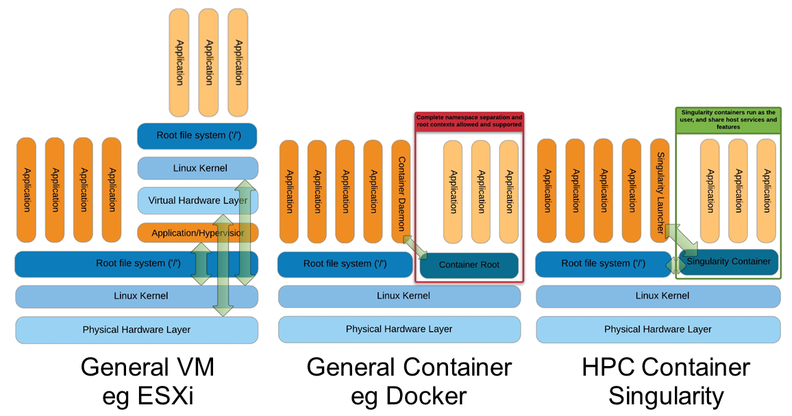

.. _singularity-page:

*******************
Singularity
*******************

Introduction to Singularity
=============================


* Focus:
	* Reproducibility to scientific computing and the high-performance computing (HPC) world.
* Origin: Lawrence Berkeley National Laboratory. Later spin-off: Sylabs
* Version 1.0 -> 2016
* More information: `https://en.wikipedia.org/wiki/Singularity_(software) <https://en.wikipedia.org/wiki/Singularity_(software)>`__

Singularity architecture
---------------------------




===================================================== =====================================================
Strengths                                             Weaknesses
===================================================== =====================================================
No dependency of a daemon                             At the time of writing only good support in Linux
Can be run as a simple user                           Mac experimental. Desktop edition. Only running
Avoids permission headaches and hacks                 For some features you need root account (or sudo)
Image/container is a file (or directory)
More easily portable

Two types of images: Read-only (production)
Writable (development, via sandbox)

===================================================== =====================================================

**Trivia**

Nowadays, there may be some confusion since there are two projects:

* `Apptainer Singularity <https://github.com/apptainer/singularity>`__
* `Sylabs Singularity <https://sylabs.io/singularity/>`__

They "forked" in 2021. So far they share most of the codebase, but eventually this could be different, and software might have different functionality.

The former is already "End Of Life" and its development continues named as `Apptainer <http://apptainer.org/>`_, under the support of the Linux Foundation.

Container registries
====================

Container images, normally different versions of them, are stored in container repositories.

These repositories can be browser or discovered within, normally public, container registries.

Docker Hub
----------

It is the first and most popular public container registry (which provides also private repositories).

* `Docker Hub <https://hub.docker.com>`__

Example:

`https://hub.docker.com/r/biocontainers/fastqc <https://hub.docker.com/r/biocontainers/fastqc>`__

.. code-block:: console

	singularity build fastqc-0.11.9_cv7.sif docker://biocontainers/fastqc:v0.11.9_cv7


Biocontainers
-------------

* `Biocontainers <https://biocontainers.pro>`__

Website gathering Bioinformatics focused container images from different registries.

Originally Docker Hub was used, but now other registries are preferred.

Example: `https://biocontainers.pro/tools/fastqc <https://biocontainers.pro/tools/fastqc>`__

Via quay.io
***********

`https://quay.io/repository/biocontainers/fastqc <https://quay.io/repository/biocontainers/fastqc>`__

.. code-block:: console

	singularity build fastqc-0.11.9.sif docker://quay.io/biocontainers/fastqc:0.11.9--0


Via Galaxy project prebuilt images
**********************************

.. code-block:: console

	singularity pull --name fastqc-0.11.9.sif https://depot.galaxyproject.org/singularity/fastqc:0.11.9--0


Galaxy project provides all Bioinformatics software from the BioContainers initiative as Singularity prebuilt images. If download and conversion time of images is an issue, this might be the best option for those working in the biomedical field.

Link: https://depot.galaxyproject.org/singularity/

Running and executing containers
--------------------------------

Once we have some image files (or directories) ready, we can run processes.

Singularity shell
*****************

The straight-forward exploratory approach is equivalent to ``docker run -ti biocontainers/fastqc:v0.11.9_cv7 /bin/shell`` but with a more handy syntax.

.. code-block:: console

	singularity shell fastqc-0.11.9.sif


Move around the directories and notice how the isolation approach is different in comparison to Docker. You can access most of the host filesystem.

Singularity exec
****************

That is the most common way to execute Singularity (equivalent to ``docker exec``). That would be the normal approach in a HPC environment.

.. code-block:: console

    singularity exec fastqc-0.11.9.sif fastqc

Test a processing of a file from *testdata* directory:

.. code-block:: console

    singularity exec fastqc-0.11.9_cv7.sif fastqc B7_input_s_chr19.fastq.gz


Singularity run
***************

This executes runscript from recipe definition (equivalent to ``docker run``). Not so common for HPC uses. More common for instances (servers).

.. code-block:: console

    singularity run fastqc-0.11.9.sif


Environment control
*******************

By default Singularity inherits a profile environment (e.g., PATH environment variable). This may be convenient in some circumstances, but it can also lead to unexpected problems when your own environment clashes with the default one from the image.

.. code-block:: console

    singularity shell -e fastqc-0.11.9.sif
    singularity exec -e fastqc-0.11.9.sif fastqc
    singularity run -e fastqc-0.11.9.sif


Compare ``env`` command with and without -e modifier.

.. code-block:: console

    singularity exec fastqc-0.11.9.sif env
    singularity exec -e fastqc-0.11.9.sif env


Singularity advanced aspects
============================


Bind paths (aka volumes)
------------------------

Paths of host system mounted in the container

* Default ones, no need to mount them explicitly (for 3.6.x): ```$HOME``` , ```/sys:/sys``` , ```/proc:/proc```, ```/tmp:/tmp```, ```/var/tmp:/var/tmp```, ```/etc/resolv.conf:/etc/resolv.conf```, ```/etc/passwd:/etc/passwd```, and ```$PWD```  `Ref <https://apptainer.org/docs/user/main/bind_paths_and_mounts.html>`__

For others, need to be done explicitly (syntax: host:container)

.. code-block:: console

    mkdir datatest
    touch datatest/testout
    singularity shell -e -B ./datatest:/scratch fastqc-0.11.9.sif
    > touch /scratch/testin
    > exit
    ls -l testdir


Exercise
********

Using the 2 fastq available files, process them outside and inside a mounted directory using fastqc.

.. raw:: html

   <details>
   <summary><a>Suggested solution</a></summary>


.. code-block:: console

	# Let's create a dummy directory
	mkdir datatest

	# Let's copy contents of testdata in that directory

	singularity exec fastqc.sif fastqc datatest/*fastq.gz

	# Check you have some HTMLs there. Remove them
	rm datatest/*html

	# Let's use shell
	singularity shell fastqc.sif
	> cd datatest
	> fastqc *fastq.gz
	> exit

	# Check you have some HTMLs there. Remove them
	singularity exec -B ./datatest:/scratch fastqc.sif fastqc /scratch/*fastq.gz

	# What happens here!
	singularity exec -B ./datatest:/scratch fastqc.sif bash -c 'fastqc /scratch/*fastq.gz'

.. raw:: html

  </details>


Singularity tips
----------------

Troubleshooting
***************

.. code-block:: console

     singularity --help

Fakeroot
********

Singularity permissions are an evolving field. If you don't have access to ``sudo``, it might be worth considering using **--fakeroot/-f** parameter.

* More details at `https://apptainer.org/docs/user/main/fakeroot.html <https://apptainer.org/docs/user/main/fakeroot.html>`__

Singularity cache directory
***************************

.. code-block::

    $HOME/.singularity

* It stores cached images from registries, instances, etc.
* If problems may be a good place to clean. When running ``sudo``, $HOME is /root.

Global singularity configuration
********************************

Normally at ``/etc/singularity/singularity.conf`` or similar (e.g preceded by ``/usr/local/``)

* It can only be modified by users with administration permissions
* Worth noting ``bind path`` lines, which point default mounted directories in containers

NOTE: Version at the CRG
************************

.. code-block::

        module use /software/as/el7.2/EasyBuild/CRG/modules/all
	#module spider singularity -> This search for modules with that name
	#module spider apptainer
        #module load Singularity/3.7.0
        module load Apptainer/1.0.3
